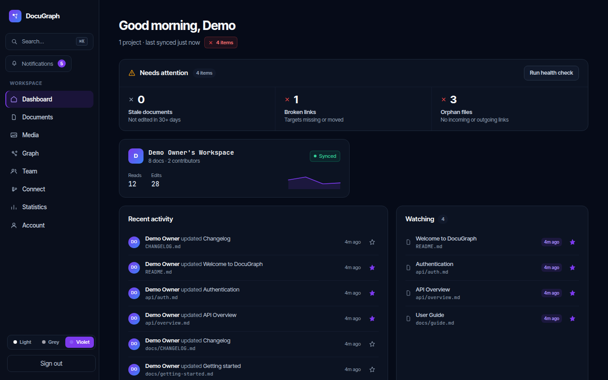
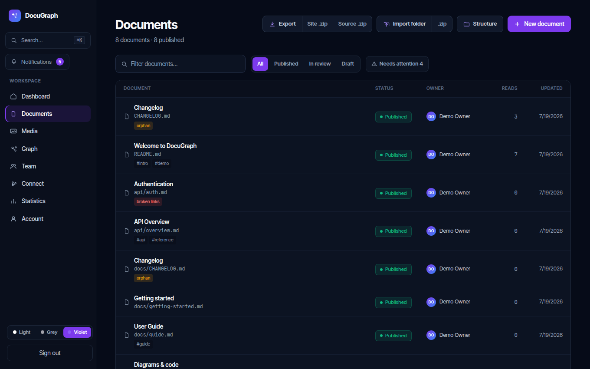
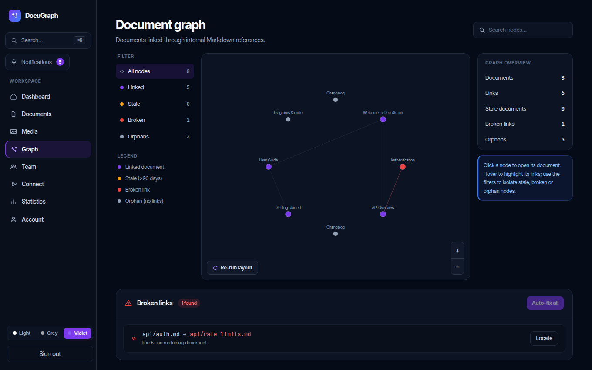
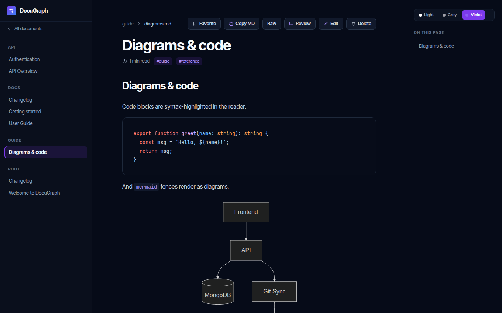
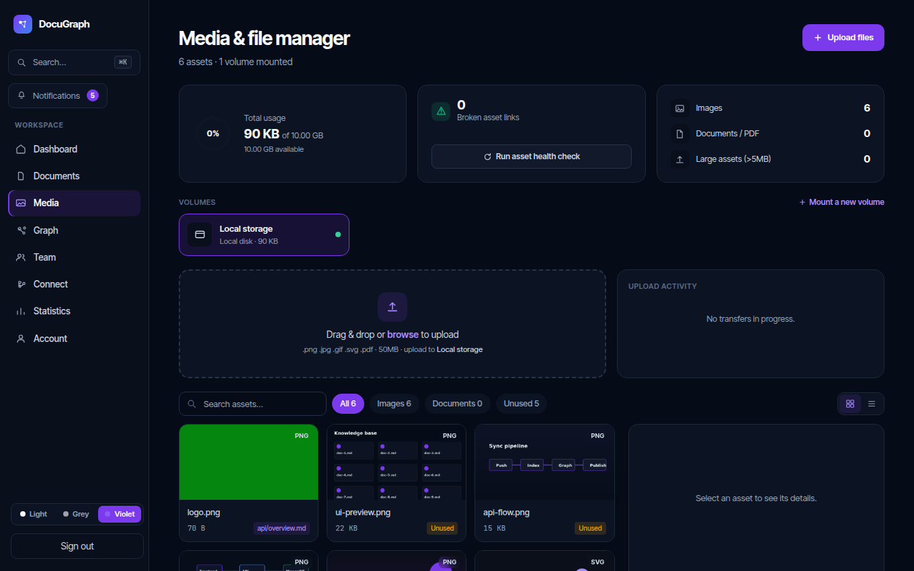
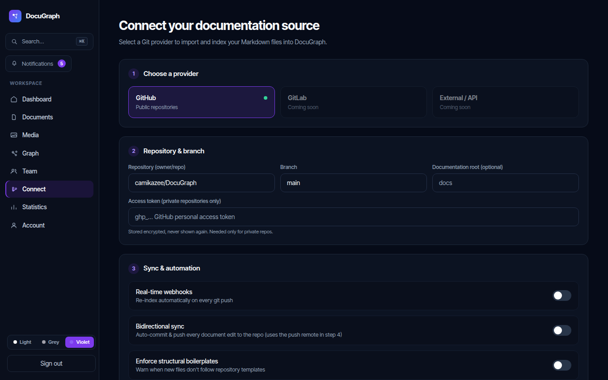

# DocuGraph — live demo & walkthrough

A guided tour of DocuGraph with screenshots from the seeded demo workspace.
No accounts, no cloud.

## Run it yourself (one command)

The demo stack builds everything and **auto-seeds** a realistic workspace on
first boot — nothing else to run:

```bash
docker compose -f docker-compose.demo.yml up -d --build
```

Then open **http://localhost:3002** and sign in with a demo account
(password **`Demo1234!`**):

| Email                   | Role   |
| ----------------------- | ------ |
| owner@demo.docugraph    | Owner  |
| editor@demo.docugraph   | Editor |
| viewer@demo.docugraph   | Viewer |

Transactional email (reset/invite) is caught by **Mailpit** at
http://localhost:8025. The seed is idempotent. Clean slate:
`docker compose -f docker-compose.demo.yml down -v && docker compose -f docker-compose.demo.yml up -d --build`.

**Standing it up on a server** (browsing from another machine): point the URLs
at the host so the browser can reach the API:

```bash
NEXT_PUBLIC_API_URL=http://SERVER:3000/api/v1 \
APP_URL=http://SERVER:3002 CORS_ORIGINS=http://SERVER:3002 \
docker compose -f docker-compose.demo.yml up -d --build
```

> Demo only — inline demo secrets, no TLS. For a real deployment use
> `docker-compose.portainer.yml` and `DEPLOY.md`.

<details>
<summary>Alternative: dev compose + manual seed</summary>

```bash
docker compose up -d --build     # mongo + backend + frontend + mailpit
cd backend && npm run seed       # demo workspace: users, docs, media, links
```
</details>

---

## What you're looking at

### Dashboard — health & activity at a glance
Documentation health (broken links, orphans, stale), recent activity, watching,
favorites, and your recently-viewed documents.



### Documents — Markdown as code
Every doc is a Markdown file (Git is the source of truth, MongoDB is the index).
Tags, per-document health badges, a "Needs attention" filter, plus **Export**
(single HTML / static-site ZIP / raw `.md` ZIP) and **Import** (a folder from
disk or a `.zip`, mirroring the whole tree).



### Graph — the knowledge graph
Documents linked through internal Markdown references, with backlinks and
broken-link highlighting. Filter by linked / stale / broken / orphan.



### Reader — rich Markdown
Syntax-highlighted code, rendered **Mermaid** diagrams, reading time, tags,
copy/raw toggle, an "on this page" outline, and per-user **Favorite**.



### Media — pluggable storage volumes
Local / S3 / FTP / SFTP behind one VFS. Encrypted credentials, connection
tests, broken-asset detection, and moving assets between volumes.



### Connect — Git source & publishing
Index a GitHub repository (public, or private with an encrypted token),
real-time webhooks, bidirectional auto-sync, and one-click **Publish to Git**.



---

## Highlights to try in the demo

- **Health & graph wedge** — open a doc, break a link, watch the Graph and
  dashboard flag it; use **Auto-fix all** on the broken-links report.
- **Collaboration** — watch a document, `@mention` a teammate in a review
  comment, and see in-app + email notifications (Mailpit at
  http://localhost:8025) with an opt-in daily digest.
- **Import/export** — import a folder or `.zip` of Markdown, then download the
  whole workspace as a static site or raw-source ZIP.
- **Audit** (as Owner) — every access/admin and document-level action is logged
  at **Team → Audit log**.

See the top-level [README](../../Readme.md) and [ROADMAP](../../ROADMAP.md) for
the full feature list and what's next.
